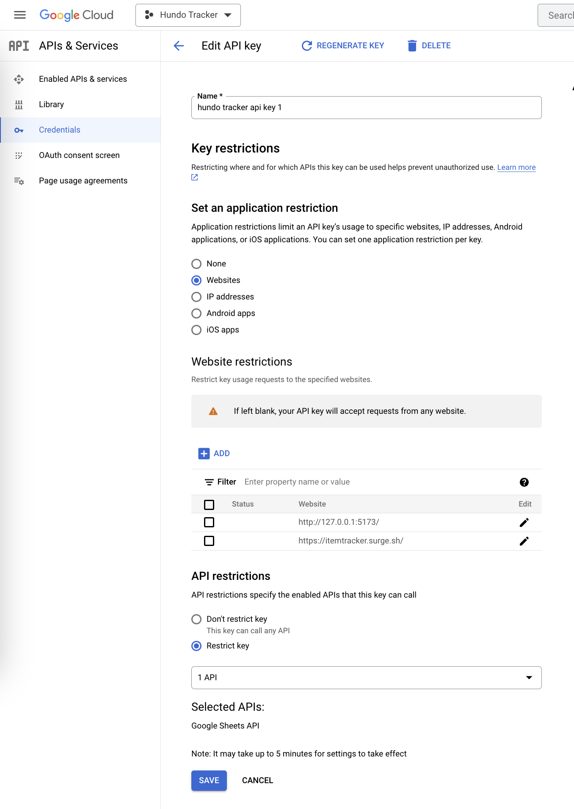

<a href="https://codingpractice.surge.sh/" target="_blank">codingpractice.surge.sh</a>

## What is this?

Using [spaced repitition](https://en.wikipedia.org/wiki/Spaced_repetition) it provides a link to a coding challenge that you need to practice.

The list of coding challenges is based on the [Grind 75](https://www.techinterviewhandbook.org/grind75?weeks=26&hours=40&order=all_rounded&grouping=none) list excluding premium questions. 

There are 157 easy, medium, and hard questions in total.

## Tech stack

- [Vite](https://vitejs.dev/) as a build tool
- [TypeScript](https://www.typescriptlang.org/), [ReactJS](https://react.dev/), and [TailwindCSS](https://tailwindcss.com/docs/guides/vite) frontend
- [Google Sheets](https://developers.google.com/sheets/api/guides/concepts) backend

## How to set up Google Sheets as a backend

- Open [Google Cloud Console](https://console.cloud.google.com/)
- Create a new Project called `Coding Practice`
- APIs & Services > Credentials > Create Credentials > API key

