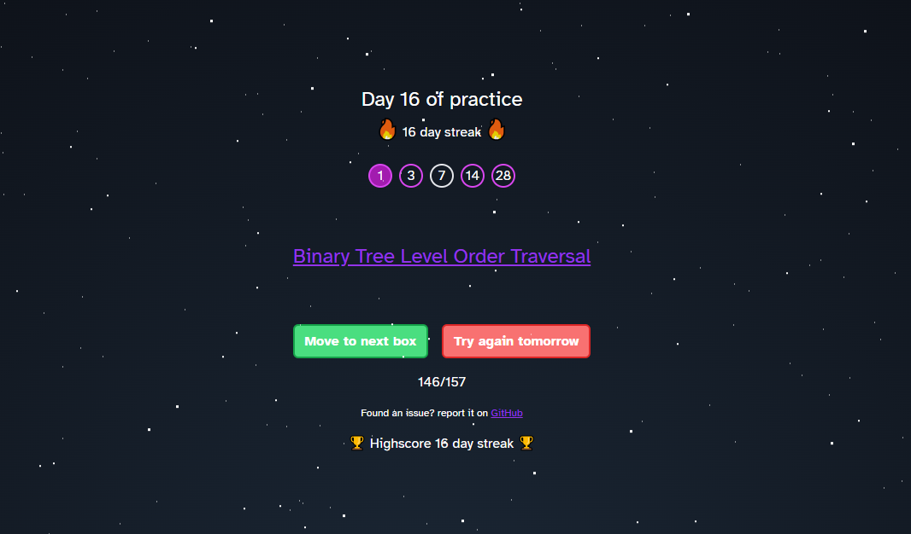

[uxdx.dev/codingpractice](https://uxdx.dev/codingpractice/)

## What is this?

There are 157 easy, medium, and hard questions in total.

The list of coding challenges is based on the [Grind 75](https://www.techinterviewhandbook.org/grind75?weeks=26&hours=40&order=all_rounded&grouping=none) list excluding premium questions. 

Using [spaced repitition](https://en.wikipedia.org/wiki/Spaced_repetition) this app provides a link to a coding challenge that you need to practice.

There are 5 boxes that contain challenges. Each box is accessible on a specific day of practice. For example, box 1 is available everyday, box 3 is available every 3 days, box 7 is available every 7 days, box 14 is available every 14 days, and box 28 is available every 28 days.

The day of practice will reset after 28 days, but the challenges will remain in their boxes so you can continue your practice each month.

## Tech stack

- [Vite](https://vitejs.dev/) as a build tool
- [TypeScript](https://www.typescriptlang.org/), [ReactJS](https://react.dev/), and [TailwindCSS](https://tailwindcss.com/docs/guides/vite) frontend
- [Google Sheets](https://developers.google.com/sheets/api/guides/concepts) backend

## How to set up Google Sheets as a backend

- Open [Google Cloud Console](https://console.cloud.google.com/)
- Create a new Project called `Coding Practice`
- APIs & Services > Credentials > Create Credentials > API key

